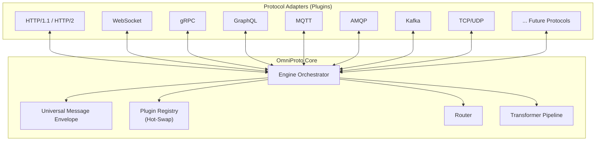

# OmniProto — Universal Meta-Protocol Framework

A meta-protocol framework that can speak **every protocol** — current and future — through a hot-swappable plugin architecture. It functions as both an **embeddable library** and a **standalone service**.

## Core Architecture



## Key Design Decisions

### Language: TypeScript (Node.js)

| Consideration | Why TypeScript |
|---|---|
| **Plugin ecosystem** | npm has libraries for virtually every protocol |
| **Hot reloading** | Dynamic `import()` makes hot-swapping trivial |
| **Dual mode** | Works as library (`import`) and service (`npx omniproto`) |
| **Developer experience** | Strong types + interfaces = safe plugin development |
| **Async I/O** | Event loop handles thousands of concurrent protocol connections |
| **User familiarity** | Based on conversation history, aligns with your stack |

### Universal Message Envelope (UME)

Every message flowing through OmniProto is normalized into a **UME** — a protocol-agnostic canonical format:

```typescript
interface UniversalMessageEnvelope {
  id: string;                    // Unique message ID
  timestamp: number;             // Unix ms
  source: {
    protocol: string;            // e.g. "http", "mqtt", "grpc"
    adapter: string;             // adapter instance ID  
    address: string;             // origin address/topic/channel
  };
  destination?: {
    protocol: string;
    adapter: string;
    address: string;
  };
  headers: Record<string, any>;  // Protocol-agnostic metadata
  body: Buffer | string | object;// Payload in any form
  encoding: string;              // "json", "protobuf", "xml", "binary", etc.
  pattern: MessagePattern;       // "request-response" | "publish-subscribe" | "stream" | "fire-and-forget"
  context: Record<string, any>;  // Tracing, auth, custom data
  replyTo?: string;              // For request-response correlation
}
```

### Protocol Adapter Interface

Every adapter implements this contract:

```typescript
interface ProtocolAdapter {
  readonly name: string;
  readonly version: string;
  readonly capabilities: AdapterCapabilities;

  // Lifecycle
  initialize(config: AdapterConfig): Promise<void>;
  start(): Promise<void>;
  stop(): Promise<void>;
  destroy(): Promise<void>;

  // Messaging
  send(envelope: UME): Promise<UME | void>;
  onReceive(handler: (envelope: UME) => Promise<void>): void;

  // Health
  healthCheck(): Promise<HealthStatus>;

  // Hot-swap support
  getState(): Promise<SerializableState>;
  restoreState(state: SerializableState): Promise<void>;
}
```

### Plugin Registry (Hot-Swap)

- Adapters can be **loaded, unloaded, and replaced at runtime** without stopping the engine
- State is serialized before unload and restored after reload
- File watcher mode: drop a new adapter file into a directory → automatically loaded

### Router

- Rule-based message routing: "HTTP requests to `/api/*` → forward to gRPC adapter"
- Pattern matching on UME fields (source protocol, headers, body content)
- Supports: direct routing, fan-out (one-to-many), fan-in (many-to-one), conditional

### Transformer Pipeline

- Middleware chain that processes UME before routing
- Built-in transforms: JSON↔Protobuf, XML↔JSON, schema mapping, header injection
- Custom transforms via simple function interface

---

## Proposed Changes

### Project Structure (Monorepo)

```
omniproto/
├── packages/
│   ├── core/                    # Engine, UME, Router, Registry, Transformer
│   │   ├── src/
│   │   │   ├── engine.ts        # Main orchestrator
│   │   │   ├── ume.ts           # Universal Message Envelope types + helpers
│   │   │   ├── registry.ts      # Plugin Registry (hot-swap)
│   │   │   ├── router.ts        # Message Router
│   │   │   ├── transformer.ts   # Transformer Pipeline
│   │   │   ├── adapter.ts       # Protocol Adapter interface
│   │   │   ├── errors.ts        # Custom error types
│   │   │   ├── logger.ts        # Structured logger
│   │   │   └── index.ts         # Public API exports
│   │   ├── tests/
│   │   ├── package.json
│   │   └── tsconfig.json
│   ├── adapters/
│   │   ├── http/                # HTTP/1.1 + HTTP/2 adapter
│   │   ├── websocket/           # WebSocket adapter
│   │   ├── tcp/                 # TCP/UDP raw socket adapter
│   │   ├── grpc/                # gRPC adapter
│   │   ├── graphql/             # GraphQL adapter
│   │   ├── mqtt/                # MQTT adapter
│   │   ├── redis/               # Redis Pub/Sub adapter
│   │   └── kafka/               # Kafka adapter
│   ├── cli/                     # Standalone service CLI
│   │   ├── src/
│   │   │   ├── cli.ts           # CLI entry point
│   │   │   ├── config.ts        # Config file parser
│   │   │   └── server.ts        # Standalone server
│   │   └── package.json
│   └── sdk/                     # Developer SDK (high-level API)
│       ├── src/
│       │   └── index.ts
│       └── package.json
├── examples/
│   ├── http-to-websocket/       # Bridge HTTP → WebSocket
│   ├── rest-to-grpc/            # REST API → gRPC backend
│   └── mqtt-to-kafka/           # IoT MQTT → Kafka pipeline
├── package.json                 # Workspace root
├── tsconfig.base.json
└── README.md
```

> [!IMPORTANT]
> **Phase 1 (what we build first):** Core engine + HTTP adapter + WebSocket adapter + TCP adapter. This gives us a working foundation that proves the architecture. Other adapters follow the exact same pattern and can be added incrementally.

---

### Phase 1 Files

#### [NEW] [package.json](file:///home/privateproperty/.gemini/antigravity/scratch/omniproto/package.json)
Root workspace configuration using npm workspaces.

#### [NEW] [tsconfig.base.json](file:///home/privateproperty/.gemini/antigravity/scratch/omniproto/tsconfig.base.json)
Shared TypeScript configuration for all packages.

#### [NEW] [ume.ts](file:///home/privateproperty/.gemini/antigravity/scratch/omniproto/packages/core/src/ume.ts)
Universal Message Envelope types, factory functions, serialization/deserialization helpers.

#### [NEW] [adapter.ts](file:///home/privateproperty/.gemini/antigravity/scratch/omniproto/packages/core/src/adapter.ts)
`ProtocolAdapter` interface and `AdapterCapabilities` types. The contract every protocol plugin must implement.

#### [NEW] [registry.ts](file:///home/privateproperty/.gemini/antigravity/scratch/omniproto/packages/core/src/registry.ts)
Plugin Registry with hot-swap support: `register()`, `unregister()`, `replace()`, `watchDirectory()`. Emits lifecycle events.

#### [NEW] [router.ts](file:///home/privateproperty/.gemini/antigravity/scratch/omniproto/packages/core/src/router.ts)
Message Router with rule-based routing: pattern matching on UME fields, fan-out, fan-in, conditional routing.

#### [NEW] [transformer.ts](file:///home/privateproperty/.gemini/antigravity/scratch/omniproto/packages/core/src/transformer.ts)
Transformer Pipeline: composable middleware chain for UME transformation (JSON↔XML, header injection, schema mapping).

#### [NEW] [engine.ts](file:///home/privateproperty/.gemini/antigravity/scratch/omniproto/packages/core/src/engine.ts)
Core Engine orchestrator: initializes registry, wires up router and transformer, manages adapter lifecycle, exposes public API.

#### [NEW] [logger.ts](file:///home/privateproperty/.gemini/antigravity/scratch/omniproto/packages/core/src/logger.ts)
Structured logger with levels, context propagation, and pluggable output.

#### [NEW] [errors.ts](file:///home/privateproperty/.gemini/antigravity/scratch/omniproto/packages/core/src/errors.ts)
Custom error hierarchy: `OmniProtoError`, `AdapterError`, `RoutingError`, `TransformError`.

#### [NEW] [index.ts](file:///home/privateproperty/.gemini/antigravity/scratch/omniproto/packages/core/src/index.ts)
Public API exports for the `@omniproto/core` package.

#### [NEW] HTTP Adapter (`packages/adapters/http/`)
Full HTTP/1.1 + HTTP/2 server & client adapter. Converts HTTP requests/responses ↔ UME.

#### [NEW] WebSocket Adapter (`packages/adapters/websocket/`)
WebSocket server & client adapter. Bi-directional streaming ↔ UME.

#### [NEW] TCP Adapter (`packages/adapters/tcp/`)
Raw TCP/UDP socket adapter. Binary streams ↔ UME.

---

## Usage Preview

Once built, OmniProto will be used like this:

### As a Library
```typescript
import { OmniProto } from '@omniproto/core';
import { HttpAdapter } from '@omniproto/adapter-http';
import { WebSocketAdapter } from '@omniproto/adapter-websocket';

const omni = new OmniProto();

// Register adapters (hot-swappable)
omni.register(new HttpAdapter({ port: 3000 }));
omni.register(new WebSocketAdapter({ port: 3001 }));

// Route: HTTP POST /messages → broadcast via WebSocket
omni.route({
  from: { protocol: 'http', match: { method: 'POST', path: '/messages' } },
  to: { protocol: 'websocket', action: 'broadcast' },
  transform: [
    (ume) => { ume.headers['x-forwarded-by'] = 'omniproto'; return ume; }
  ]
});

await omni.start();
```

### As a Standalone Service (config file)
```yaml
# omniproto.yml
adapters:
  - name: http
    config:
      port: 8080

  - name: websocket  
    config:
      port: 8081

  - name: grpc
    config:
      port: 50051
      protoFiles: ["./protos/service.proto"]

routes:
  - from:
      protocol: http
      match: { path: "/api/*" }
    to:
      protocol: grpc
      action: forward
    transforms:
      - json-to-protobuf
```

```bash
npx omniproto start --config omniproto.yml
```

---

## Verification Plan

### Automated Tests

1. **Unit tests** for each core module (UME, Registry, Router, Transformer, Engine):
   ```bash
   cd /home/privateproperty/.gemini/antigravity/scratch/omniproto
   npm test -- --filter=core
   ```
   - UME: creation, serialization, validation
   - Registry: register, unregister, hot-swap, state persistence
   - Router: pattern matching, fan-out, conditional routing
   - Transformer: pipeline chaining, built-in transforms

2. **Integration test** — HTTP → WebSocket bridge:
   ```bash
   npm test -- --filter=integration
   ```
   - Start OmniProto with HTTP + WebSocket adapters
   - Send HTTP POST → verify WebSocket client receives the message
   - Send WebSocket message → verify HTTP endpoint can retrieve it

3. **Hot-swap test**:
   - Start engine with HTTP adapter
   - Replace HTTP adapter at runtime with a modified version
   - Verify zero downtime and state preservation

### Manual Verification

1. **Run the example bridge**: Start the HTTP↔WebSocket example, open a browser WebSocket client, and send HTTP requests via curl — verify messages flow through
2. **Hot-swap demo**: While the bridge is running, drop a new adapter file into the plugins directory and verify it loads automatically
