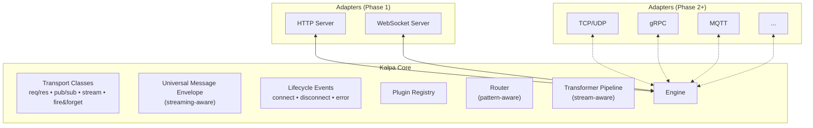
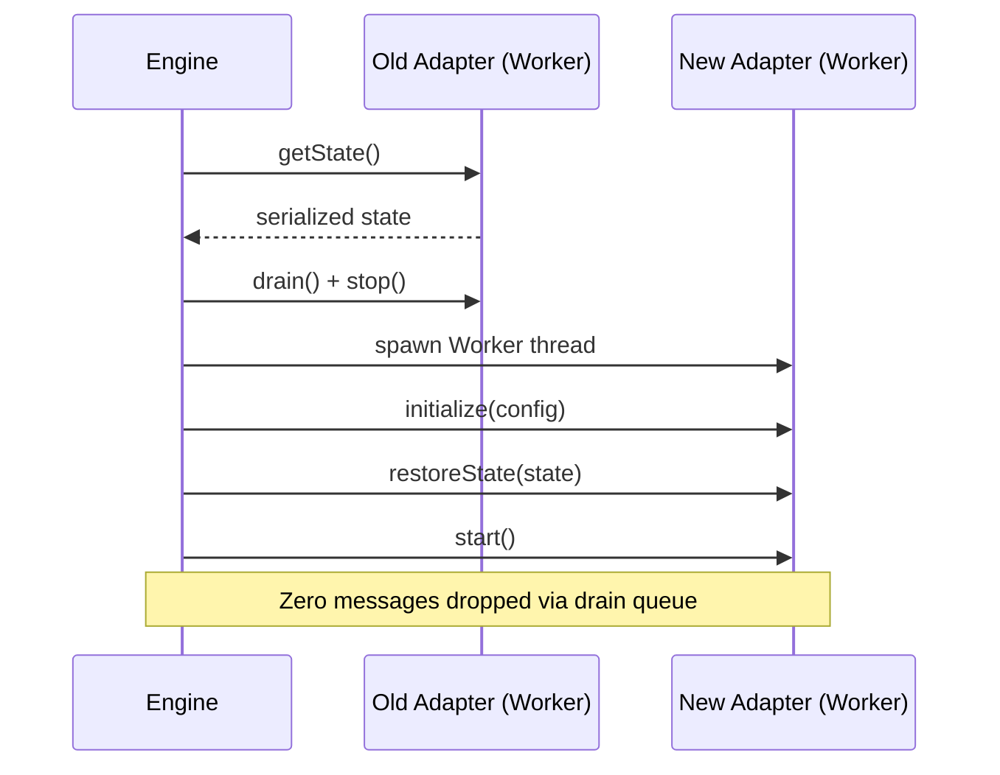

# Kalpa (कल्प) — Universal Meta-Protocol Framework

**"The Express.js of protocol bridging."** — A developer-first, embeddable meta-protocol framework that turns protocols into interchangeable transport drivers.

**Identity:** Lightweight integration engine for developers. Not a full ESB (MuleSoft), not just an API gateway (Kong). Think: *what Express did for HTTP, Kalpa does for all protocols.*

## Core Architecture (Revised)



---

## Changes From V1 (Incorporating AI Review)

| Feedback | Source | Resolution |
|---|---|---|
| Narrow Phase 1 — prove the bridge first | All three | Phase 1 = core + HTTP server + WS server only, prove HTTP→WS bridge |
| UME body needs streaming | Gemini, Claude | `body` type = `Buffer \| string \| object \| ReadableStream` |
| Connection lifecycle events | Gemini | System UME events: `kalpa:connect`, `kalpa:disconnect`, `kalpa:error` |
| Transport Classes prevent UME degradation | ChatGPT | Adapters declare supported patterns; engine enforces compatibility |
| Hot-swap is harder than it looks | All three | Phase 1 = plugin-ready architecture only. Phase 2 = Worker thread hot-swap |
| Node.js module caching | Gemini | Worker thread isolation for adapter runtime (Phase 2) |
| Define identity | ChatGPT | "Express.js of protocol bridging" — dev-first, embeddable |
| Skip transformer initially | Claude | Included but minimal — JSON header injection only in Phase 1 |

---

## Key Design: Transport Classes

Adapters declare what transport patterns they support. The engine **enforces compatibility** at routing time — preventing impossible routes (e.g., fire-and-forget → request-response).

```typescript
enum TransportClass {
  REQUEST_RESPONSE = 'request-response',  // HTTP, gRPC unary
  PUBLISH_SUBSCRIBE = 'pub-sub',          // MQTT, Redis, Kafka
  STREAM = 'stream',                      // WebSocket, gRPC stream, TCP
  FIRE_AND_FORGET = 'fire-and-forget',    // UDP, logging
}

interface AdapterCapabilities {
  supportedClasses: TransportClass[];
  supportsClient: boolean;
  supportsServer: boolean;
  supportsBinary: boolean;
  supportsStreaming: boolean;
  maxMessageSize?: number;
}
```

## Key Design: Streaming UME

```typescript
interface UniversalMessageEnvelope {
  id: string;
  timestamp: number;
  source: { protocol: string; adapter: string; address: string };
  destination?: { protocol: string; adapter: string; address: string };
  headers: Record<string, any>;
  body: Buffer | string | object | ReadableStream;  // ← streaming support
  encoding: 'json' | 'protobuf' | 'xml' | 'binary' | 'text' | string;
  pattern: TransportClass;
  context: Record<string, any>;  // tracing, auth, custom
  replyTo?: string;
  // System lifecycle
  systemEvent?: 'kalpa:connect' | 'kalpa:disconnect' | 'kalpa:error' | string;
}
```

## Key Design: Hot-Swap Strategy (Phase 2)



---

## Project Structure

```
kalpa/
├── packages/
│   ├── core/                    # Engine, UME, Router, Registry, Transformer
│   │   └── src/
│   │       ├── engine.ts        # Orchestrator
│   │       ├── ume.ts           # UME types + factories + streaming helpers
│   │       ├── transport.ts     # Transport Classes + capability system
│   │       ├── registry.ts      # Plugin Registry (load/unload)
│   │       ├── router.ts        # Pattern-aware message Router
│   │       ├── transformer.ts   # Stream-aware Transformer Pipeline
│   │       ├── adapter.ts       # Protocol Adapter interface
│   │       ├── lifecycle.ts     # Connection lifecycle event handling
│   │       ├── errors.ts        # Error hierarchy
│   │       ├── logger.ts        # Structured logger
│   │       └── index.ts         # Public API
│   └── adapters/
│       ├── http/                # HTTP/1.1+2 server adapter (Phase 1)
│       └── websocket/           # WebSocket server adapter (Phase 1)
├── examples/
│   └── http-to-websocket/       # Phase 1 proof: HTTP→WS bridge
├── package.json
├── tsconfig.base.json
└── README.md
```

---

## Phase 1 Scope (Strict)

> [!IMPORTANT]
> Phase 1 goal: **Prove one bridge works flawlessly.** HTTP POST → WebSocket broadcast. That validates UME, Router, Transformer, and Lifecycle.

| Include | Exclude |
|---|---|
| Core engine | TCP/UDP adapter |
| UME with streaming body | Hot-swap implementation |
| Transport Classes + enforcement | Client-mode adapters |
| Plugin Registry (load/unload) | Worker thread isolation |
| Pattern-aware Router | YAML config / CLI |
| Basic Transformer (header inject) | Schema translation |
| HTTP server adapter | gRPC, MQTT, Kafka, etc. |
| WebSocket server adapter | Admin dashboard |
| Connection lifecycle events | Load balancing |
| HTTP→WS bridge example | — |

---

## Usage Preview (Phase 1)

```typescript
import { Kalpa } from '@kalpa/core';
import { HttpAdapter } from '@kalpa/adapter-http';
import { WebSocketAdapter } from '@kalpa/adapter-websocket';

const kalpa = new Kalpa();

kalpa.register(new HttpAdapter({ port: 3000 }));
kalpa.register(new WebSocketAdapter({ port: 3001 }));

// HTTP POST /messages → broadcast to all WebSocket clients
kalpa.route({
  from: { protocol: 'http', match: { method: 'POST', path: '/messages' } },
  to: { protocol: 'websocket', action: 'broadcast' },
  transform: [
    (ume) => { ume.headers['x-routed-by'] = 'kalpa'; return ume; }
  ]
});

// Listen for WebSocket connections
kalpa.on('kalpa:connect', (event) => {
  console.log(`Client connected via ${event.source.protocol}`);
});

await kalpa.start();
// That's it. HTTP requests now flow to WebSocket clients.
```

---

## Verification Plan

### Phase 1 Tests

1. **Core unit tests:**
   ```bash
   npm test -- --filter=core
   ```
   - UME creation + streaming body
   - Transport class enforcement (reject incompatible routes)
   - Router pattern matching
   - Transformer pipeline execution

2. **Integration test — HTTP→WS bridge:**
   ```bash
   npm test -- --filter=integration
   ```
   - Start Kalpa with HTTP + WS adapters
   - `curl -X POST localhost:3000/messages -d '{"text":"hello"}'`
   - Verify WebSocket client receives `{"text":"hello"}`
   - Verify lifecycle events fire on WS connect/disconnect

3. **Browser demo:**
   - Open browser WebSocket to `ws://localhost:3001`
   - Send HTTP requests via curl
   - See messages appear in browser in real-time
