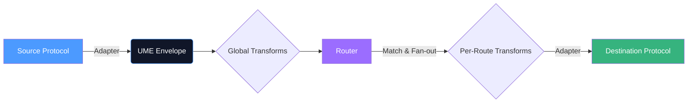

<div align="center">

# 🌌 कल्प Kalpa

**The Universal Meta-Protocol Framework**

[](https://opensource.org/licenses/MIT)
[](https://nodejs.org/)
[](https://www.typescriptlang.org/)
[](http://makeapullrequest.com)

*Bridge any protocol to any protocol. Zero code required.*

[Architecture](#architecture) • [Quick Start](#quick-start) • [Protocols](#supported-protocols) • [Examples](#use-cases)

</div>

---

Kalpa is a programmable protocol router runtime. It acts as the universal translator for your system's nervous system, connecting HTTP, WebSocket, TCP, UDP, SSE, MQTT, and gRPC through a single unified message format (**UME**) with intelligent pattern routing, backpressure, and zero-downtime hot-swap capabilities.

## ✨ Why Kalpa?

The modern internet is a mess of overlapping protocols. IoT devices speak **MQTT**, microservices speak **gRPC**, browsers need **WebSockets** and **SSE**, and legacy systems use **TCP/UDP**. 

When these systems need to talk, developers write fragile, custom "glue code." 

**Kalpa eliminates glue code.** You define the source, the destination, and how the data should be transformed in a single, declarative YAML file. Kalpa handles the connections, the routing, the backpressure, and the schema conversion.

## 🚀 Quick Start

### 1. No-Code Service Mode (CLI)

You don't need to write TypeScript to use Kalpa. You can run it directly using the CLI and a YAML configuration.

```bash
# Start the Kalpa runtime
npx tsx packages/cli/src/cli.ts start --config kalpa.yml
```

**`kalpa.yml` (Example: HTTP POST to WebSocket Broadcast)**
```yaml
adapters:
  # 1. Listen for HTTP
  sensor-api:
    type: http-server
    port: 3000
    
  # 2. Host a WebSocket server
  live-feed:
    type: websocket-server
    port: 3001

routes:
  # 3. Route HTTP POSTs directly to WebSocket clients
  - id: sensor-to-dashboard
    from: 
      protocol: http
      match: { method: POST, path: /messages }
    to: 
      protocol: websocket
      adapter: live-feed
      action: broadcast
```

### 2. Programmatic Library Mode
Embed Kalpa directly in your Node.js/TypeScript applications.

```typescript
import { Kalpa } from '@kalpa/core';
import { HttpAdapter } from '@kalpa/adapter-http';
import { WebSocketAdapter } from '@kalpa/adapter-websocket';

const kalpa = new Kalpa();

// Register your adapters
await kalpa.register(new HttpAdapter(), { name: 'http', port: 3000 });
await kalpa.register(new WebSocketAdapter(), { name: 'ws', port: 3001 });

// Define routes
kalpa.route({
  id: 'http-to-ws',
  from: { protocol: 'http', match: { method: 'POST', path: '/messages' } },
  to: { protocol: 'websocket', adapter: 'ws', action: 'broadcast' },
});

await kalpa.start();
```

## 🔌 Supported Protocols (8 and counting)

Kalpa maps every connection to a strict compatibility matrix (e.g., you cannot route a fire-and-forget UDP datagram to a request-response HTTP endpoint).

| Protocol | Mode | Transport Classes | Best For |
|---|---|---|---|
| **HTTP** | Server + Client | `REQUEST_RESPONSE` | REST APIs, Webhooks |
| **WebSocket** | Server + Client | `STREAM`, `PUBLISH_SUBSCRIBE` | Real-time browser data |
| **SSE** | Server | `STREAM`, `PUBLISH_SUBSCRIBE` | One-way browser push |
| **gRPC** | Server + Client | `REQUEST_RESPONSE`, `STREAM` | Microservices (Protobuf) |
| **MQTT** | Client | `PUBLISH_SUBSCRIBE`, `FIRE_AND_FORGET` | IoT Sensors, Messaging |
| **TCP** | Server + Client | `STREAM`, `FIRE_AND_FORGET` | Raw socket streams |
| **UDP** | Server + Client | `FIRE_AND_FORGET` | Telemetry, logging |

## 🏗️ Architecture



### Core Concepts

1. **Universal Message Envelope (UME):** Every incoming payload (JSON, Protobuf, binary, text) is immediately normalized into a standard UME format before it hits the routing engine.
2. **Backpressure Engine:** Heavy loads? Kalpa's `MessageQueue` supports `DROP_OLDEST`, `DROP_NEWEST`, and `BLOCK` strategies to prevent V8 memory exhaustion.
3. **Zero-Downtime Hot-Swap:** Need to upgrade an adapter? Replace it live. Kalpa queues in-flight messages in an in-process drain queue and flushes them to the new adapter seamlessly.

## 💡 Real-World Use Cases

<details>
<summary><b>1. The IoT Gateway (MQTT → HTTP + SSE)</b></summary>

Thousands of sensors report data via MQTT. You want to save that data to a REST API database, and simultaneously push it live to a browser dashboard using Server-Sent Events.  
*In Kalpa: 1 YAML file, 3 adapters, 2 routes (Fan-out).*

</details>

<details>
<summary><b>2. The Legacy Microservice Bridge (REST → gRPC)</b></summary>

You are modernizing a backend to gRPC, but legacy frontends still expect REST HTTP.  
*In Kalpa: Receive HTTP POST, transform it to a gRPC Unary Request, return the gRPC response as an HTTP JSON payload.*

</details>

<details>
<summary><b>3. The Fire-and-Forget Logger (TCP → UDP)</b></summary>

A legacy system blasts telemetry data over a streaming TCP socket. You need to convert this to localized UDP datagrams for a local monitoring sidecar.

</details>

## 🚢 Docker deployment

```bash
docker build -t kalpa:latest .

# Mount your YAML config and expose the necessary ports
docker run -v ./your-config.yml:/config/kalpa.yml -p 3000:3000 -p 3001:3001 kalpa:latest
```

## 🧪 Testing

Kalpa's core is incredibly resilient, backed by a perfect 66/66 test suite ensuring zero regressions across Hot-Swap, Backpressure, TCP chunking, and routing.

```bash
npm install
npm test
```

## 📄 License

Kalpa is open-source and released under the [MIT License](LICENSE).
